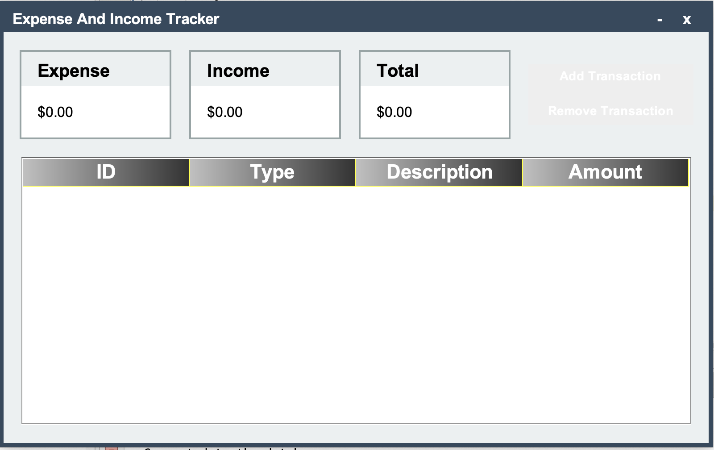
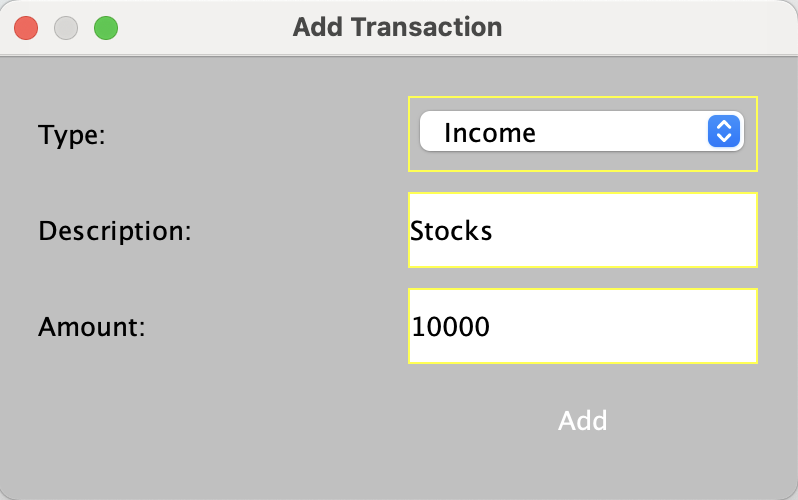
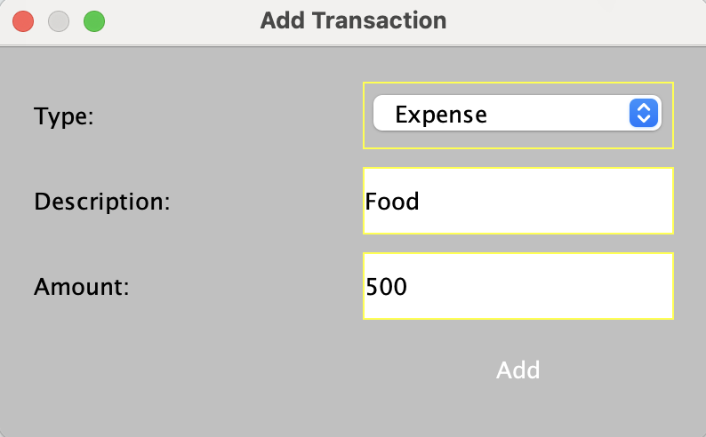
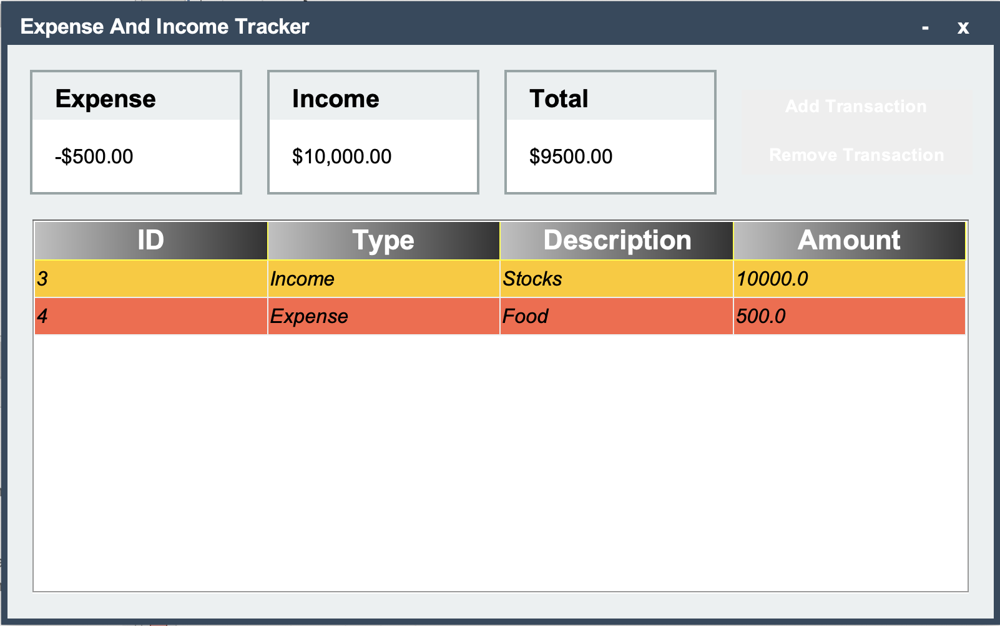
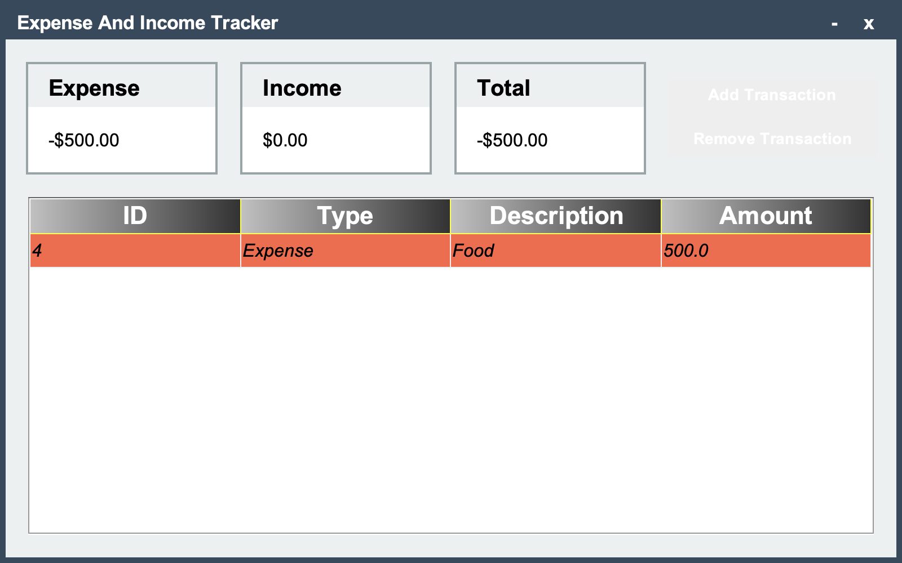

# Personal Expense Tracker

## Project Overview
The **Personal Expense Tracker** is a desktop application designed to help users manage and track their income and expenses efficiently. This project uses **Java** (Swing and Applet) for the frontend and **SQL**, **PHP**, and **XAMPP** for the backend, providing a robust system for storing and retrieving financial data.

## Screenshots

















### Key Features
- **User Registration and Login:** Secure authentication using a PHP and SQL backend.
- **Expense Tracking:** Users can add, edit, and delete expenses.
- **Income Tracking:** Track multiple income sources.
- **Expense Categories:** Categorize expenses for easy analysis.
- **Data Visualization:** Visual representation of expenses using graphs (Applet).
- **Predictive Insights:** Basic predictive analysis of future expenses.
- **Budget Alerts:** Notifications when spending exceeds set budgets.
  
## Technologies Used
- **Java (Swing & Applet):** For creating the user interface and interactive components.
- **SQL:** To store user data, expenses, and income records.
- **PHP:** To interact with the SQL database for data operations.
- **XAMPP:** Local server setup for PHP and MySQL.
  
## Setup and Installation
### Prerequisites
- Java Development Kit (JDK)
- XAMPP (for MySQL and PHP)
- A Java IDE (e.g., IntelliJ, Eclipse)
  
### Installation Steps
1. **Clone the Repository:**
   ```bash
   git clone https://github.com/your-repo/personal-expense-tracker.git
   ```
2. **Start XAMPP:**
   - Open XAMPP and start the Apache and MySQL services.
   
3. **Database Setup:**
   - Create a MySQL database named `expense_tracker`.
   - Import the SQL script located in the `database` folder into your database.

4. **Configure Database Connection:**
   - Update the database credentials in the `db_config.php` file located in the `php` folder.

5. **Run the Application:**
   - Compile and run the Java application using your preferred IDE.

## Usage
1. Launch the application.
2. Register or log in using your credentials.
3. Navigate through the dashboard to add, edit, or delete income and expenses.
4. View your financial summary and graphical reports.

## Contributors
- **Rohit Kumar** 
- **Ayush Baoker**
- **Abhigyan Shukla**
- **Govind Jee**

## License
This project is licensed under the MIT License. See the LICENSE file for more details.
